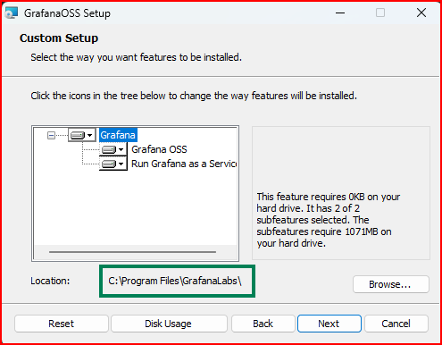

# Grafana and Loki Setup Guide (Windows)

This guide covers setting up Grafana and Loki for centralized test logging on Windows.

## 1. Download Grafana


1. Visit the [Grafana website](https://grafana.com/grafana/download?platform=windows)
2. Select the latest **stable version** of Grafana
3. Click on the **"Windows"** tab
4. Under **"Windows Installer (.msi)"**, click **"Download the installer"**


> [!NOTE]
> Choose the appropriate installer for your machine architecture (32-bit or 64-bit).
> The MSI installer package is designed specifically for Windows systems and includes everything needed to integrate Grafana with your Windows environment.

## 2. Install Grafana

1. Locate the downloaded MSI file (usually in your Downloads folder)
2. **Right-click on the file and select "Run as administrator"**


> [!IMPORTANT]
> Running as administrator is crucial. The installer requires administrative privileges to configure Grafana as a Windows service.
> 
> If you don't see "Run as administrator" in the context menu, simply double-click the installer. Windows will prompt you with a User Account Control (UAC) dialog - click "Yes" to proceed.

### Follow the Installation Wizard


1. On the welcome screen, click **"Next"**


2. Read and accept the license agreement, then click **"Next"**



3. Configure installation options:
   - **Installation location**: The default (`C:\Program Files\GrafanaLabs\`) is recommended
   - **Service configuration**: Keep **"Install Grafana as a service"** checked
   - Click **"Next"** to continue


4. Click **"Install"** to begin the installation


5. If prompted by User Account Control (UAC), click **"Yes"** to allow the service installation


6. Wait for the installation to complete


7. Click **"Finish"** to exit the installer

## 3. Verify the Installation

1. Check that the Grafana service is running:
   - Press `Win+R`, type `services.msc` and press Enter
   - Look for "Grafana" in the services list - it should show "Running" status


2. Open your web browser and navigate to: **[http://localhost:3000/](http://localhost:3000/)**


3. Log in with the default credentials:
   - Username: `admin`
   - Password: `admin`

4. You'll be prompted to change the default password - create a secure password


5. After successful login, you'll see the Grafana home page - this confirms proper installation


## 4. Changing the Default Port (Optional) [Not Needed]

If you need to use a different port (default is 3000), follow these steps:

1. Navigate to the Grafana configuration directory:
   ```
   C:\Program Files\GrafanaLabs\grafana\conf
   ```


2. Create a new file named `custom.ini` (you can copy `sample.ini` and rename it)

3. Add the following configuration to the file:
   ```ini
   [server]
   http_port = 3000   # Change this number to your desired port
   domain = localhost

   [security]
   admin_user = admin
   admin_password = admin
   disable_initial_admin_creation = false

   [users]
   default_theme = dark

   [auth.anonymous]
   enabled = false
   ```

> [!NOTE]
> Always edit `custom.ini`, never modify `defaults.ini` directly.
> The semicolon (`;`) is used as a comment character in ini files.

4. Save the file and restart the Grafana service:
   - Press `Win+R`, type `services.msc` and press Enter
   - Find "Grafana", right-click and select "Restart"

## 5. Grafana Directory Structure Reference

After installation, your Grafana directory (`C:\Program Files\GrafanaLabs\`) will contain these files and folders:

```
GRAFANALABS/
├─ grafana/
│  ├─ bin/                  # Executable files
│  │  ├─ grafana-cli.exe
│  │  ├─ grafana-server.exe
│  │  ├─ grafana.exe
│  ├─ conf/                 # Configuration files
│  │  ├─ custom.ini         # Your custom settings (if created)
│  │  ├─ defaults.ini       # Default settings (don't edit)
│  │  ├─ sample.ini         # Example configuration file
│  ├─ data/                 # Database and logs
│  ├─ docs/
├─ nssm-2.24/
│  ├─ src/
│  ├─ win32/
│  │  ├─ nssm.exe
│  ├─ win64/
│  │  ├─ nssm.exe
│  ├─ ChangeLog.txt
│  ├─ README.txt
├─ svc-11.6.1.0/
│  ├─ nssm.exe
│  └─ [other folders]    # Additional resources
└─ [service folders]     # Service management components
```

> [!WARNING]
> After making configuration changes, restart your computer to ensure all settings take effect properly. 
> This ensures any port conflicts are resolved and the new service configuration is completely loaded.

## Next Steps

Now that Grafana is installed, proceed to set up Loki for log aggregation:

➡️ [Loki Installation Guide](../guide/02_Loki_Install_Locally.md)
