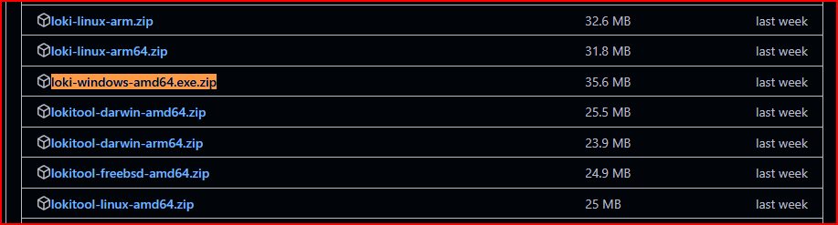
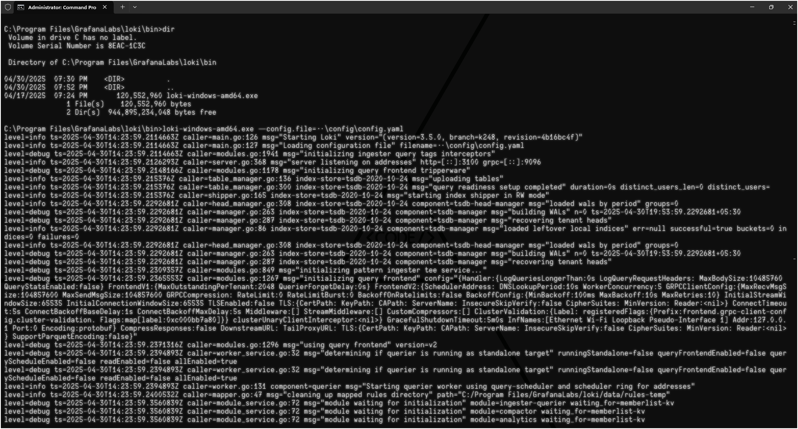

# Installing Loki for Windows

Unlike Grafana, Loki doesn't provide an official Windows installer. We'll use the binary approach, which requires some manual setup but gives more flexibility.

## 1. Download the Loki Binary

1. Go to the [Grafana Loki releases page on GitHub](https://github.com/grafana/loki/releases/)
2. Find the latest stable release (avoid pre-release versions) (currently v3.5.0)


3. Scroll down to the "Assets" section and click "Show all assets"


4. Download the Windows binary: `loki-windows-amd64.exe.zip`



> [!NOTE]
> You're downloading a pre-compiled binary executable of Loki designed for Windows 64-bit systems. This binary contains the core Loki service that will receive, process, and store logs.

## 2. Create Directory Structure

1. Open File Explorer
2. Navigate to where you want to install Loki (recommended: `C:\Program Files\GrafanaLabs\`)
3. Create a folder named `loki`
4. Inside the `loki` folder, create these subdirectories:
   - `bin` - For the Loki executable
   - `config` - For configuration files
   - `data` - For storage
   - `logs` - For Loki's own log files

> [!NOTE]
> This organized directory structure separates binary files, configuration, data storage, and logs, making maintenance easier and following best practices.

## 3. Extract and Install the Binary

1. Locate the downloaded `loki-windows-amd64.exe.zip` file
2. Right-click and select **"Extract All..."**
3. Extract to a temporary location
4. Move the extracted `loki-windows-amd64.exe` file to:
   ```
   C:\Program Files\GrafanaLabs\loki\bin\loki-windows-amd64.exe
   ```

## 4. Create Configuration File

1. Open a text editor with administrator privileges (Notepad or VS Code recommended)


2. Create a new file with the following content:

```yaml
auth_enabled: false

server:
  http_listen_port: 3100
  grpc_listen_port: 9096
  log_level: debug
  grpc_server_max_concurrent_streams: 1000

common:
  instance_addr: 127.0.0.1
  path_prefix: C:/Program Files/GrafanaLabs/loki/data
  storage:
    filesystem:
      chunks_directory: C:/Program Files/GrafanaLabs/loki/chunks
      rules_directory: C:/Program Files/GrafanaLabs/loki/rules
  replication_factor: 1
  ring:
    kvstore:
      store: inmemory

query_range:
  results_cache:
    cache:
      embedded_cache:
        enabled: true
        max_size_mb: 100

limits_config:
  metric_aggregation_enabled: true

schema_config:
  configs:
    - from: 2020-10-24
      store: tsdb
      object_store: filesystem
      schema: v13
      index:
        prefix: index_
        period: 24h

pattern_ingester:
  enabled: true
  metric_aggregation:
    loki_address: localhost:3100

ruler:
  alertmanager_url: http://localhost:9093

frontend:
  encoding: protobuf
```

3. Save this file as `config.yaml` in the config directory:
   ```
   C:\Program Files\GrafanaLabs\loki\config\config.yaml
   ```


> [!IMPORTANT]
> This configuration has been specifically adjusted for Loki 3.5.0+. If you encounter errors, ensure the configuration matches the version of Loki you downloaded. For more details about this configuration, see [Loki Configuration Guide](../extra/Loki_config_yaml_explanation.md).

## 5. Test Loki's Functionality

Before setting up Loki as a service, let's verify that it works:

1. Open Command Prompt as Administrator
2. Navigate to the Loki bin directory:
   ```cmd
   cd "C:\Program Files\GrafanaLabs\loki\bin"
   ```

3. Run Loki with the configuration file:
   ```cmd
   loki-windows-amd64.exe --config.file=..\config\config.yaml
   ```

4. You should see Loki start up with log messages in the console:



5. Open a web browser and navigate to:
   ```
   http://localhost:3100/ready
   ```

6. You should see the text "ready" indicating Loki is running properly:


   > [!NOTE]
   > Initially, you might see "Ingester not ready: waiting for 15s after being ready".  
   > Wait 15-20 seconds and refresh the page.

7. You can also verify Loki is working by checking:
   ```
   http://localhost:3100/metrics
   ```


8. Press `Ctrl+C` in the command prompt to stop Loki

## 6. Setting Up Loki as a Windows Service

To have Loki run automatically at startup, we'll set it up as a Windows service in the next guide.

> [!NOTE]
> Now that you've verified Loki works properly, you're ready to connect it to Grafana in the next guide.

## Next Steps

Continue to the next guide to learn how to:
- Set up Loki as a Windows service
- Configure Grafana to use Loki as a data source
- Start sending logs to Loki
