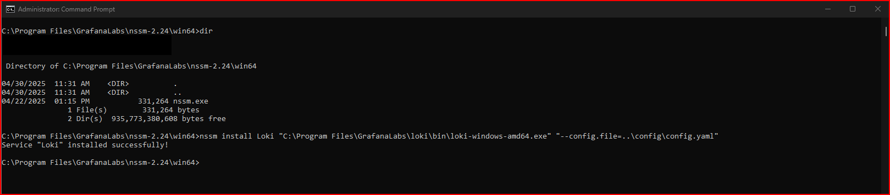
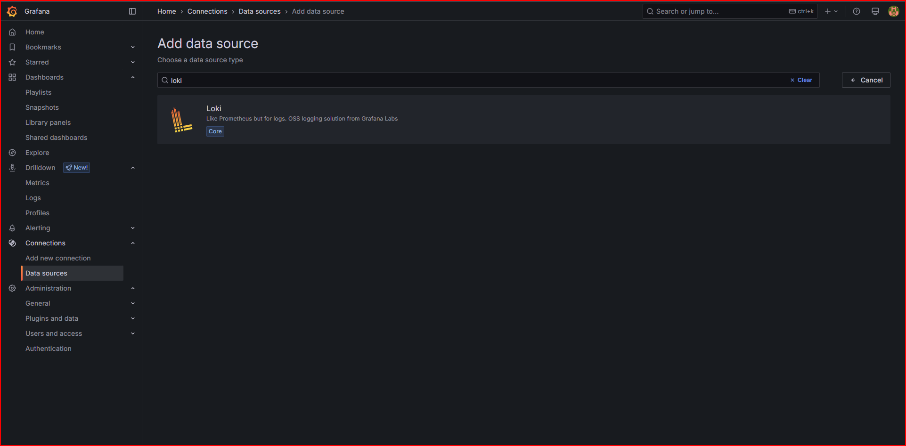

# Setting Up Loki as a Windows Service

This guide explains how to install Loki as a Windows service using NSSM (Non-Sucking Service Manager), which is included with your Grafana installation.

## 1. Locate NSSM Executable

When you installed Grafana, NSSM was installed along with it:

1. Navigate to the NSSM directory:
   ```
   C:\Program Files\GrafanaLabs\nssm-2.24
   ```

2. Inside this folder, you'll find two directories:
   - `win32` - For 32-bit Windows systems
   - `win64` - For 64-bit Windows systems (most modern systems)

```
NSSM-2.24/
├─ src/
├─ win32/             # 32-bit version
│  ├─ nssm.exe
├─ win64/             # 64-bit version
│  ├─ nssm.exe
├─ ChangeLog.txt
├─ README.txt
```

> [!NOTE]
> Choose the appropriate directory based on your Windows system architecture. Most modern systems use 64-bit Windows.

## 2. Install Loki as a Service

1. Open Command Prompt as Administrator
   - Press `Win+X` and select "Command Prompt (Admin)"

2. Navigate to the appropriate NSSM directory:
   ```cmd
   cd "C:\Program Files\GrafanaLabs\nssm-2.24\win64"
   ```

3. Run the NSSM install command to create a Windows service for Loki:
   ```cmd
   nssm install Loki "C:\Program Files\GrafanaLabs\loki\bin\loki-windows-amd64.exe" "--config.file=..\config\config.yaml"
   ```

   This command:
   - Creates a new Windows service named "Loki"
   - Points to the Loki executable
   - Provides the path to the configuration file

   

4. Start the Loki service:
   ```cmd
   net start Loki
   ```

## 3. Verify the Service Installation

1. Check that the Loki service is running:
   - Press `Win+R`, type `services.msc` and press Enter
   - Look for "Loki" in the services list - it should show "Running" status

2. Verify Loki is working by opening a browser and navigating to:
   ```
   http://localhost:3100/ready
   ```

3. You should see "ready" displayed, indicating that Loki is running properly as a service.

> [!IMPORTANT]
> If the service fails to start, check the Windows Event Viewer for error messages under the Windows Logs > Application section.

## 4. Connect Grafana to Loki

Now that Loki is running as a service, you can connect Grafana to use it as a data source:

1. Open Grafana in your browser: `http://localhost:3000`

2. Log in with your Grafana credentials

3. In the Grafana interface:
   - Go to Configuration (gear icon in the left sidebar)
   - Select "Data Sources"
   - Click "Add data source"
   


4. Select "Loki" from the list of data sources

5. Configure the data source:
   - Set URL to `http://localhost:3100`
   - Leave other settings at their defaults
   - Click "Save & Test"


6. You should see a success message indicating that Grafana can connect to Loki

## 5. Service Management Commands

Here are some useful commands for managing the Loki service:

```cmd
# Start the Loki service
net start Loki

# Stop the Loki service
net stop Loki

# Restart the Loki service
net stop Loki && net start Loki

# Check the status of the Loki service
sc query Loki

# Delete the Loki service (if needed)
sc delete Loki
```

## Next Steps

Now that you have Loki running as a service and connected to Grafana, you're ready to:
- Configure your applications to send logs to Loki
- Create dashboards in Grafana to visualize your logs
- Set up alerting based on log data
